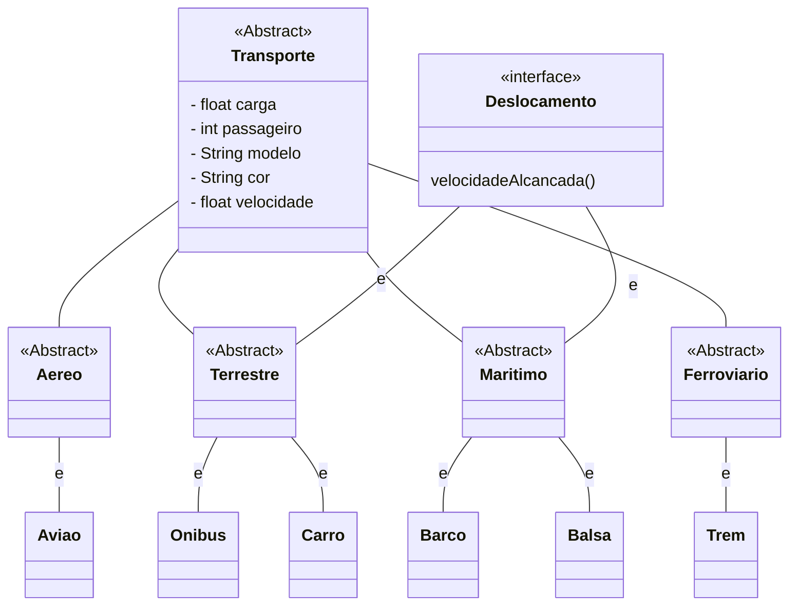
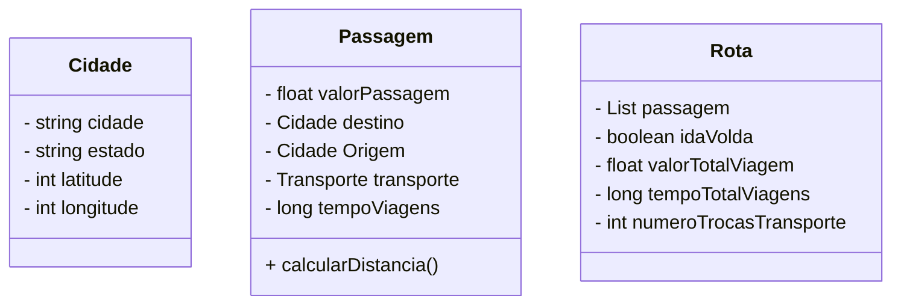

```mermaid
classDiagram
    Transporte -- Aereo
    Transporte -- Terrestre
    Transporte -- Maritimo
    Transporte -- Ferroviario

    Terrestre -- Onibus: e
    Terrestre -- Carro: e
    Aereo -- Aviao: e
    Maritimo -- Barco: e
    Ferroviario -- Trem: e
    Maritimo -- Balsa: e

    Deslocamento -- Maritimo: e
    Deslocamento -- Terrestre: e
    class Transporte {
        <<Abstract>>
        - float carga
        - int passageiro
        - String modelo
        - String cor
        - float velocidade
    }
    class Aereo{
        <<Abstract>>
    }
    class Maritimo{
        <<Abstract>>
    }
    class Terrestre{
        <<Abstract>>
    }
    class Ferroviario{
        <<Abstract>>
    }
    
    class Onibus {
    }
    class Carro {
    }
    class Aviao {
    }
    class Barco {
    }
    class Trem {
    }
    class Balsa {
    }
    

    class Deslocamento {
        <<interface>>
        velocidadeAlcancada()
    }

```

```mermaid
classDiagram
    class Cidade {
        - string cidade
        - string estado
        - int latitude
        - int longitude
    }

    class Passagem {
        - float valorPassagem
        - Cidade destino
        - Cidade Origem
        - Transporte transporte
        - long tempoViagens
        + calcularDistancia()
    }
    
    class Rota {
        - List<Passagem> passagem
        - boolean idaVolda
        - float valorTotalViagem
        - long tempoTotalViagens
        - int numeroTrocasTransporte
    }
```